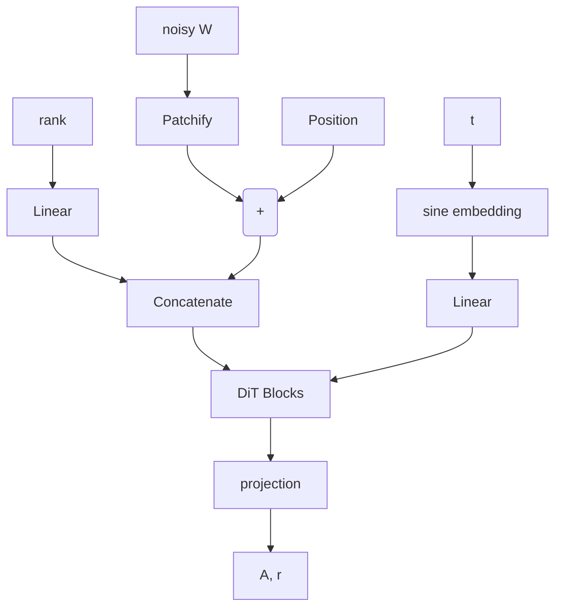

If you look at LoRa, what it tells you is that sparsity in neural networks is such that the rank of weight matrices is lower than the dimension of it. Under this assumption, we could in theory rewrite most weight matrices in a neural neightwork as the product of 2 lower rank matrices, e.g. $W_{nm} = A_{nr} * B_{rm}$. While this formula holds true for any matrix A and B witht he right dimensions, they involve some reduction in dimensionality, and thus capacity of the network, unless W is already of rank r, in which case, there already is some redundancy built-in the output space of the matrix multiplication.

Now, there are algortihms to automatically find the rank of a matrix, like [QR decomposition](https://en.wikipedia.org/wiki/QR_factorization), but these tend to be somewhat expensive in higher dimensions. Most importantly, the training algorithms do not yield truly lower rank matrices in practice.

## Hypothesis
In this work, we assume that divergences from a true lower rank matrices are normally distributed around 0. As such you could intrepret the weigth matrix as such:

$$
    \hat{W} = W + \epsilon
$$

where $\hat{W}$ is our learned estimate of the true lower rank weights $W$, and $\epsilon \sim \mathcal N(0, \sigma^2 I)$ some normally distributed noise. Further, due to normalization in the network, we may hypothesize that the standard deviation $\sigma = 1$.

Finding $W$ here is akin to denoising an image in a DDPM scheme. We could in theory train a model to satisfy the MLE here and retrieve W. However, any slight error in the prediction would make the rank estimation fail again. Instead, we start from the goal, which is the factorization of weight matrix:

$$
    \hat{W} = A_{nr} * B_{rm} + (\epsilon = A_{nr} + \epsilon') * B_{rm}
$$

Because the lower rank decomposition is not unique, we can further enforce that $B_{rn}$ be normally distributed and thus $\epsilon' \sim \mathcal N(0, I)$. Granted $r$ is the effective rank of $W$, we can compute the Moore-Penrose pseudo inverse of A as

$$
  A^{-1} = A^T(A * A^T)^{-1}
$$

This means that if we can find A through denoising, we can find W and its lower rank decomposition, all in one go.

## Training a lower rank matrix factorization model

We devise a training scheme for estimating a Lower Rank matrix factorization of an arbitrary normally distributed matrix, to be applied to weight matrix factorization. We formulate the process as a Rectified Flow problem, that is there exist an optimal transfort mapping from $\hat{A_{nr}}$ to $A_{nr}$ and the rectified flow statisfies

$$
    dA_t = v(A_t, t)dt
$$

and we solve the least square regression $min_v\int_0^1 ||(X_1 - X_0) - v(A_t, t)||^2$  where $A_t = tA_1 + (1-t)A_0$.

To generate a training set we generate random normally distributed matrices $B_{rm}$, and normally distributed matrices $A_{nr}$. We can show that A should have mean 0 and variance 1/r:

$$
  w_{ij} = \Sigma_r a_{ik} * b_{kj}
$$
$$
    E[w_{ij}] = \Sigma_r E[a_{ik} * b_{kj}] = \Sigma_r E[a_{ik}] * E[b_{kj}] = 0
$$

$$
    Var(w_{ij}) = 1 = Var(\Sigma_r a_{ik} * b_{kj}) = \Sigma_r Var(a_{ik} * b_{kj})
$$

$$
    1 =\Sigma_r (\sigma_A^2 + \mu_A^2)(\sigma_A^2 + \mu_A^2) - \mu_A^2\mu_B^2
$$

$$
    \sigma_a^2 + \mu_a^2 = 1 / r
$$

Given the expectation equation is true for any mean of A, if we arbitrarily set $\mu_a = 0$ we obtain $\sigma_A = \frac{1}{r}$. Thus we can impose that $A_{nr} \sim \mathcal N(0, \frac{1}{r}I)$.

Using these matrices, we feed $W = A * B$ into a MM-DiT inspired architecture.

An important parameter here is the effective rank that we append as an extra token at then end of the sequence. W is padded with 0s in order to match the maximum matrix size the model can handle. For simplicity, we will use a square matrix here, which should match most transformer weight matrices (same dimensionality projection).

Lastly we use the time sampling schedule from SD3.

## Results

I am still running the experiments...
