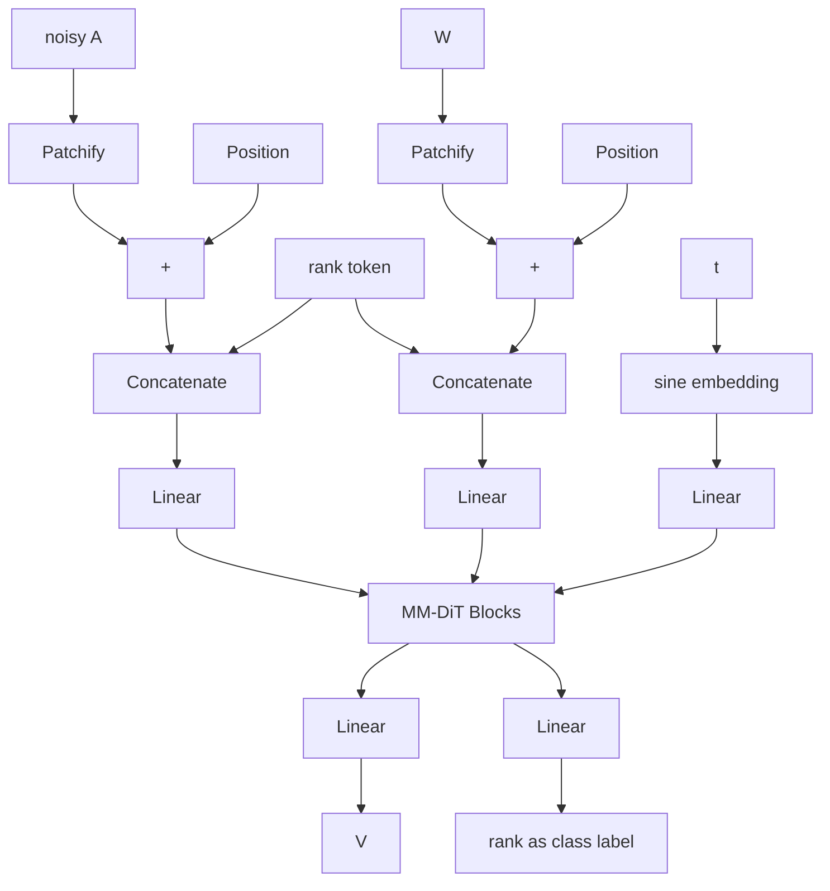

If you look at LoRa, what it tells you is that sparsity in neural networks is such that the rank of weight matrices is lower than the dimension of it. Under this assumption, we could in theory rewrite most weight matrices in a neural neightwork as the product of 2 lower rank matrices, e.g. $W_{nm} = A_{nr} * B_{rm}$. While this formula holds true for any matrix A and B witht he right dimensions, they involve some reduction in dimensionality, and thus capacity of the network, unless W is already of rank r, in which case, there already is some redundancy built-in the output space of the matrix multiplication.

Now, there are algortihms to automatically find the rank of a matrix and its decomposition in lower rank matrices, like [QR decomposition](https://en.wikipedia.org/wiki/QR_factorization), or computing the Singular Value Decomposition, but these tend to be somewhat expensive in higher dimensions. Most importantly, the training algorithms do not yield truly lower rank matrices in practice, which means these algorithms are likely to fail.

## Hypothesis
In this work, we assume that weight matrices diverge from a true lower rank matrix by some normally distributed error centered around 0. As such you could intrepret the weigth matrix as such:

$$
    \hat{W} = W + \epsilon
$$

where $\hat{W}$ is our learned estimate of the true lower rank weights $W$, and $\epsilon \sim \mathcal N(0, \sigma^2 I)$ some normally distributed noise. Further, due to normalization in the network, we may hypothesize that the standard deviation $\sigma = 1$.

Finding $W$ here is akin to denoising an image in a DDPM scheme. We could in theory train a model to satisfy the MLE here and retrieve W. However, any slight error in the prediction would make the rank estimation fail again. Instead, we start from the goal, which is the factorization of weight matrix:

$$
    \hat{W} = A_{nr} * B_{rm} + \epsilon = (A_{nr} + \epsilon') * B_{rm}
$$

Because the lower rank decomposition is not unique, we can further enforce that $B_{rn}$ be normally distributed and thus $\epsilon' \sim \mathcal N(0, I)$. Granted $r$ is the effective rank of $W$, and thus A is full rank, we can compute the left Moore-Penrose pseudo inverse of A as

$$
  A^{+} = (A^T * A)^{-1}A^T
$$

And thus we compute $B$ as

$$
    B = (A^T * A)^{-1}A^T W
$$

This means that if we can find A through denoising, we can an estimate of $W$ lower rank decomposition, all in one go. It is important to highlight that this decomposition supposes the existence of A, which is only true if A has linearly independant columns, which holds true if and only if A is of rank r.

There is however some extra complexity: in its current form the problem is still ill-posed as the decomposition is not unique:

$$
    W = (AQ) * (Q^{-1}B)
$$
for any $Q$ $r$x$r$ matrix that is invertible. This would mean that given $\hat{W}$ there are infinitely many solutions. We therefore need to further constrain A and B. Instead, we take inspiration from thin QR decomposion and we enforce that A be orthonormal and B be trapezoidal superior with all positive values.

This does mean we now have the following identities:

$$
    A^T A = I_r
$$
$$
    A^T W = B
$$

$A$ being orthonormal, we fix the column space, and B being trapezoidal superior fixes rotations and the sign being positive fixes the symetries. So the decomposition is now unique.

## Training a lower rank matrix factorization model

We devise a training scheme for estimating a Lower Rank matrix factorization of an arbitrary normally distributed matrix, to be applied to weight matrix factorization. We formulate the process as a Rectified Flow problem, that is there exist an optimal transfort mapping from $\hat{A_{nr}}$ to $A_{nr}$ and the rectified flow statisfies

$$
    dA_t = v(A_t, t)dt
$$

and we solve the least square regression $min_v\int_0^1 ||(X_1 - X_0) - v(A_t, t)||^2$  where $A_t = tA_1 + (1-t)A_0$.

As a working asumption we assume $W$ is normally distributed (Central Limit Theorem), with 0 mean and unit variance (which can be obtained by normalizing the layer weights before feeding them into the network). This might not be true in practice, which we will discuss in the last section.

We generate a synthetic dataset as follows. First we sample $X \sim \mathcal N(0, 1)$. Then we use QR factorisation and keep Q. We set $A = Q$ and thus A is orthonormal. Then we sample B, such that the top left rxr sub-matrix is triangular superior with normally distributed values with 0 mean, and the lower part of the trapezoid is full and sampled following a centered normal distribution. As of the variance of the distributions from which rows of B are sampled, we can derive them like so:

$$
    W_{ij} = \sum_{k=1}^r Q_{ik} B_{kj}
$$

$$
    Var(W_{ij}) = \sum_{k=1}^r Var(Q_{ik}) \cdot Var(B_{kj}) = \sum_{k=1}^r E[Q_{ik}^2] \cdot Var(B_{kj})
$$

$$
    1 = j \cdot \sigma^2_{B_j} \sum_{k=0}^j E[Q_{ik}^2] \quad \text{for } j \leq r
$$

$$
    1 = r \cdot \sigma^2_{B_r} \sum_{k=0}^r E[Q_{ik}^2] \quad \text{for } j > r
$$

Further, we can use that the distribution of A and thus of Q are invariant under rotation (this is a property of Gaussian distributions). We define the second order moment matrix
$$
    M = E_k[Q_k Q_k^T]
$$
Because of the aforementioned rotational invariance, for all rotations O we have
$$
    OQ\stackrel{d}{=}Q
$$
$$
    M = E_k[(OQ_k) (OQ_k)^T] = OMO^T
$$
This can only be true if $M = \lambda I$. Given Q is orthonormal, we have
$$
    tr(M) = \sum E[||Q_k||^2] = E[1] = 1 = n \cdot \lambda
$$
And so $E[Q_{ik}^2] = 1 / n$. Plugging this back into the the equation on the variance of the rows of B, we get:

$$
    \sigma^2_{B_j} = n / min(j, r)
$$

Using these matrices, we feed $\hat{W} = A * B + \epsilon$, $\epsilon \sim \mathcal N(0, \alpha)$, with $\alpha$ small, into a MM-DiT inspired architecture.

An important parameter here is the effective rank that we append as an extra token at then end of the sequence. For simplicity, we will use a square matrix for W here, which should match most transformer weight matrices (same dimensionality projection).

Additionally, within the MM-DiT blocks, we keep a separate lane for $\hat{W}$, allowing subsequent layers to access previous attentions on $\hat{W}$, rather than only the denoised A estimate.

The loss is computed as simple MSE loss on the rn top left sub-matrix A, using the true rank, and from the cross entropy the rank prediction, where the rank prediction is formulated as a classification problem with max-r classes. We also enforce the structure of A and B using the following 2 losses:

$$
    L_{\text{ortho}} = ||A^+A - I_r||_2
$$

We also add an extra penalty to help with converging towards perfect factorization of W:
$$
    L_{\text{triu}} = ||A^{+}\hat{W} - B||_2
$$
It is important to note that because we work with an estimate $\hat{W}$ of $W$ as reference, this loss will hardly ever be 0, as the rank of the estimate is likely different from that of $W$. This is central here as A is an estimate of the proper low rank factorization.

The network is trained using rectified flow with the logit-normal noise sampling scheme from [SD3](https://arxiv.org/pdf/2403.03206) with m = 0, s=1.

The problem of learning A only and then minimizing $||A^t \hat{W} - B||^2$ is especially hard. So we leave the door open for experimentation where we add a 3rd branch to the MM-DiT for predicting the velocity of B directly. In this case we then replace $L_{\text{triu}}$ with

$$
    L_{\text{facto}} = ||A * B - W||_2
$$

In practice this is supposedly an easier loss to optimize as it does not bear the load of the orthonormalization of A, which the single denoising objective does ($A^T = A^+$ if and only if $A$ is orthonormal).

## Sampling

The first step in the sampling procedure is to normalize the target matrix such that is has 0 mean and unit variance. We store this scaling and will apply inverse scaling of the features output by the A * B at inference time.

We take $t = 1$, initialize $A$ to pure noise, and run the RF process.

## Results

Experimentally, the single denoising target objective, that is predicting A only, fails to learn anything meaningful, with a loss plateau being reached very fast on the rank, and nothing meaningful for A.

Adding B as a separate "lane" in the MM-DiT and as a secondary velocity prediction in the rectified flow trianing, we get some learning. After 20k steps, on my toy model example (max weight size is 64, Model size ~20M parameters), the training graphs look like what's below. The true rank seems to be predicted fairly accurately at this point. For the rest, a lot more training would be required. This comes as no surprise as typically we could expect to need 10x this number of steps for convergence, from experience.

## Discussion

One important assumption we made in the training process is that $\hat{W}$ is normally distributed. Empirical experiments tend to show weight distributions are often heavy tailed, closer to Student distributions. This is poorly captured by our training setup which simulates target A as derived from a normal distribution on the basis of $\hat{W}$ itself being normally distributed, although the core mathematics don't make any assumptions on this fact being true. We suggest that further experiment actually sample real life models to build a better distribution, as transformer weights in the wild are likely to be out of distribution with this trainign scheme.
